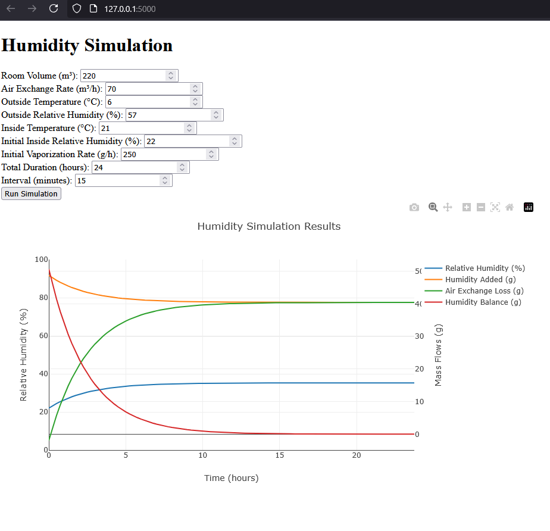

# Air humidifier

 - simulating a ramp up of an air humidifier at home.
 - simplified assumptions
 - AI assisted
 - POC 
 - seems off, but not too far off





## Containerizing

 - Initial size 744mb even with multi-stage
 - So it's the installed size of the packages 

```
REPOSITORY                 TAG           IMAGE ID       CREATED             SIZE
dash-app-multi             latest        6ac4a48b111e   3 hours ago         744MB
python                     3.11-alpine   bc84eb94541f   6 days ago          82.4MB
```

Also, not an issue with alpine
```
REPOSITORY                 TAG           IMAGE ID       CREATED             SIZE
dash-app-slim              latest        dca5c8e87bcb   44 minutes ago      807MB
python                     3.11-slim     370c586a6ffc   8 days ago          194MB
```

 - check disk size with [Dockerfile.analyse](Dockerfile.analyse) 
 - Output after removing matplotlib (29M):

```text
Package Sizes:
setuptools: 11M /usr/local/lib/python3.12/site-packages/setuptools
plotly: 187M    /usr/local/lib/python3.12/site-packages/plotly
pip: 12M        /usr/local/lib/python3.12/site-packages/pip
pandas: 76M     /usr/local/lib/python3.12/site-packages/pandas
packaging: 516K /usr/local/lib/python3.12/site-packages/packaging
numpy: 43M      /usr/local/lib/python3.12/site-packages/numpy
gunicorn: 796K  /usr/local/lib/python3.12/site-packages/gunicorn
dash: 33M       /usr/local/lib/python3.12/site-packages/dash
```


 - pandas: 76M  and numpy: 43M can be removed


```
REPOSITORY                 TAG           IMAGE ID       CREATED             SIZE
dash-app-ex-pandas         latest        bf931ebfa437   8 minutes ago       384MB
python                     3.11-alpine   bc84eb94541f   6 days ago          82.4MB
```

